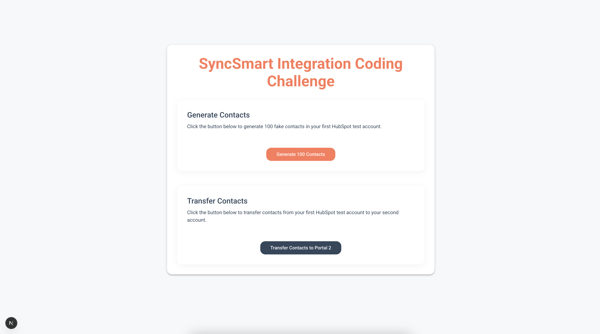

# SyncSmart Integration Coding Challenge

A Next.js application that allows for seamless data transfer between HubSpot portals. This tool demonstrates the power of the HubSpot API for cross-portal contact management.

## 🚀 Features

- **Generate Fake Contacts**: Create 100 realistic fake contacts in your HubSpot test portal with a single click
- **Cross-Portal Transfer**: Move contacts from one HubSpot portal to another effortlessly
- **Language**: Typescript
- **Modern UI**: Built with Material UI for a clean, responsive user experience
- **NextJS Framework**: Leverages the power and simplicity of Next.js with the Pages Router

### **This is the test portal 1 with the generated 100 fake contacts**

### **This is the test portal 2 with the same 100 fake contacts transferred over**
